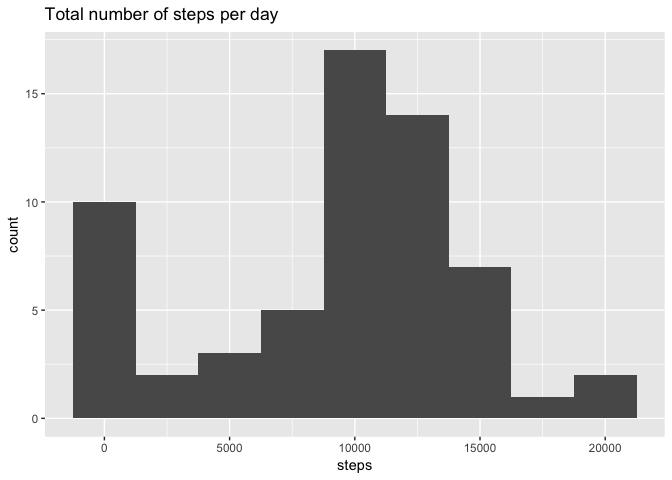
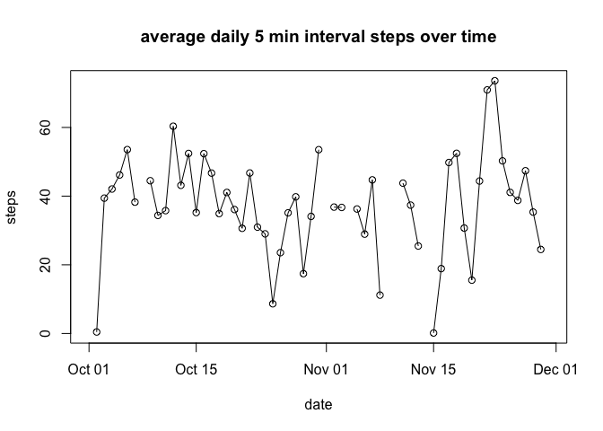
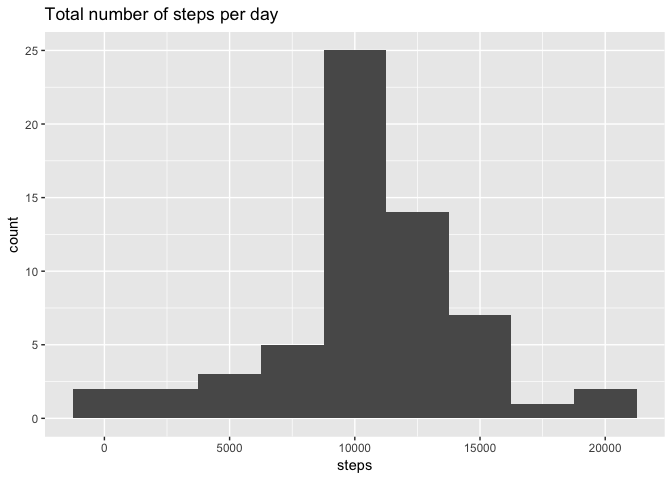
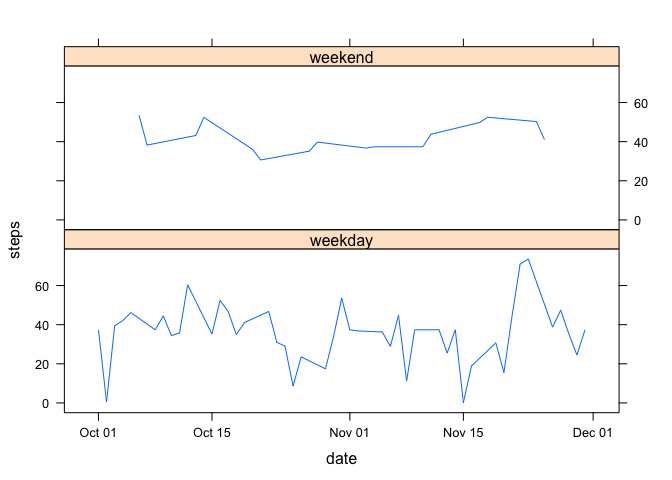

# Reproducible Research: Peer Assessment 1

## Loading and preprocessing the data
1. As the data is in our working directory we will read it and preprocess it.  

```r
unzip("activity.zip")
data <- read.csv("activity.csv")
```

## What is mean total number of steps taken per day?
Calculate the total number of steps per day  

```r
library(dplyr)
```

```
## 
## Attaching package: 'dplyr'
```

```
## The following objects are masked from 'package:stats':
## 
##     filter, lag
```

```
## The following objects are masked from 'package:base':
## 
##     intersect, setdiff, setequal, union
```

```r
dataDate <- group_by(data, date)
sum <- summarize(dataDate, steps=sum(steps, na.rm=TRUE))
```

2. Histogram of the total number of steps per day

```r
library(ggplot2)  
with(sum, qplot(steps, binwidth=2500, main="Total number of steps per day"))  
```

<!-- -->

3. Mean and median of total number of steps per day  

```r
summary(sum$steps)
```

```
##    Min. 1st Qu.  Median    Mean 3rd Qu.    Max. 
##       0    6778   10395    9354   12811   21194
```

## What is the average daily activity pattern?
4. Time series plot of the average steps for 5 min interval for each day. 

```r
mean <- summarize(dataDate, steps=mean(steps, na.rm=TRUE))
mean$date <- as.Date(as.character(mean$date))
with(mean, plot(date, steps, main="average daily 5 min interval steps over time"))
with(mean, lines(date, steps))
```

<!-- -->

5. Maximum number of steps, by daily average :   

```r
filter(mean, steps==max(steps, na.rm=TRUE))  
```

```
## # A tibble: 1 x 2
##         date    steps
##       <date>    <dbl>
## 1 2012-11-23 73.59028
```

## Imputing missing values
6. Number of missing values in the data, will appear in the TRUE column  

```r
table(!complete.cases(data))
```

```
## 
## FALSE  TRUE 
## 15264  2304
```

Function to replace the NA with the mean of steps per day, and create a new dataset : cleanData with no NAs.  

```r
cleanData <- dataDate
temp <- mean(mean$steps, na.rm=T)
cleanData[is.na(cleanData$steps),1] <- temp
```

7. Histogram of the total number of steps taken each day  

```r
cleanSum <- summarize(cleanData, steps=sum(steps, na.rm=TRUE))
with(cleanSum, qplot(steps, binwidth=2500, main="Total number of steps per day"))
```

<!-- -->
  
The plot differs, we don't have the peak on the 0.  

Mean and median of the total steps.  

```r
summary(cleanSum$steps)
```

```
##    Min. 1st Qu.  Median    Mean 3rd Qu.    Max. 
##      41    9819   10766   10766   12811   21194
```
The median and the mean differs slightly.  

## Are there differences in activity patterns between weekdays and weekends?
8. Create the factor variable wDays and plot the mean steps per interval for each day in a two panel weekday vs weekend plot.  

```r
cleanData$day <- weekdays(as.Date(as.character(cleanData$date)))
weekdays <- c("Monday", "Tuesday", "Wednesday", "Thursday", "Friday")
cleanData$wDay <- factor(cleanData$day %in% weekdays, levels=c(TRUE, FALSE), labels=c("weekday", "weekend"))
dData <- group_by(cleanData, wDay, date)
mean2 <- summarize(dData, steps=mean(steps))
mean2$date <- as.Date(as.character(mean2$date))
library(lattice)
xyplot(steps~date|wDay, mean2, layout=c(1,2), type="l")
```

<!-- -->
